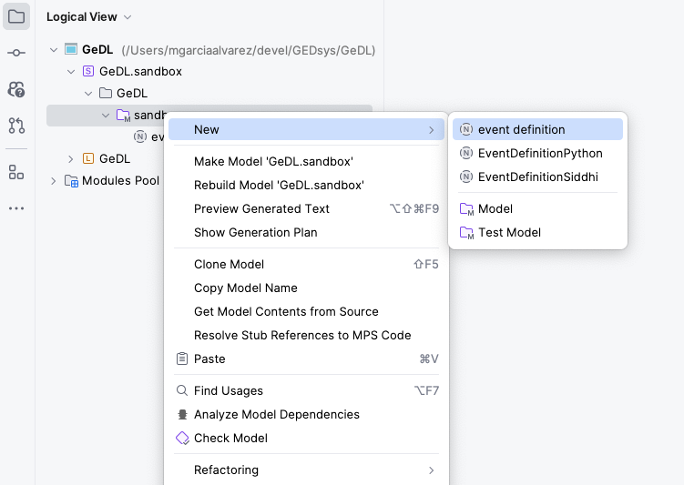

# GeDL

Geographic event Domain Language. A  domain specific programming language for the definition of **g**eographic events (gevents) in GEDSys.
[Current language grammar.](./grammar/index.md)

## Installation

**Requirements**

- [MPS 2023.3](https://www.jetbrains.com/mps/download/)

1. Clone or download the repository.
2. Using MPS, open the `GeDL` directory.
3. Make and build the language.

## Using GeDL

1. On MPS, right-click on the `sandbox` directory inside the `GeDL.sanbox` directory. Then,  **New** and click **event definiton**.

    

2. Use the new create file for defining a geographic event. Below is an example of a valid defintion. Notice is not possible to pased the code into the MPS editor, the content most be typed in.  To get started press ENTER on the first line.

    ```java
    datastream Temperature : measurement ; 
    
    event hotDay ( Temperature ){ 
        cond Temperature > 19.f <logical operator> <comparison expression>; 
        extent city = {  
        feature: 'POLYGON((3.8 48, 8.9 48.5, 9 54, 9 49.5, 3.8 48))' ,  
        srid: 4326,
        buffer: 0.5f deg 
        } ; 
        <spatial granularity> 
        <detection time> 
    }; 
    
    notification hotDayAlert( hotDay) { 
        [ Temperature ] 
    }                                                                                                                                                                                                              
    ```
3. Rebuild the solution. The `GeDL.sandbox` contains solutions for the language. Right-click on `GeDL.sandbox`, and then click on `Rebuild Solutions`.

4. Generate text. Right-click on the `event definition` item you created and click on `Preview Generated Text`. This will generate two files containing SiddhiQL and Python code that can be used by the [GeDL interpreter](../gedl-interpreter/README.md) and the [Siddhi runner](../siddhi-runner/README.md) respectively.

## Example

The following is a basic example for the defintion of a gevent for a hot day. 
For more examples, including the generated source code, see the [demo document.](../examples/DEMO.md)

```java
datastream Temperature : measurement ; 

event HotDay ( Temperature ){ 
    cond Temperature > 20.f ; 
    extent city = {  
    feature: 'POLYGON((3.8 48, 8.9 48.5, 9 54, 9 49.5, 3.8 48))', 
    srid: 4326, 
    buffer: 0.015f deg 
    } ; 
}; 

notification HotDayAlert( HotDay) { 
    [ Temperature ] 
};   
```
