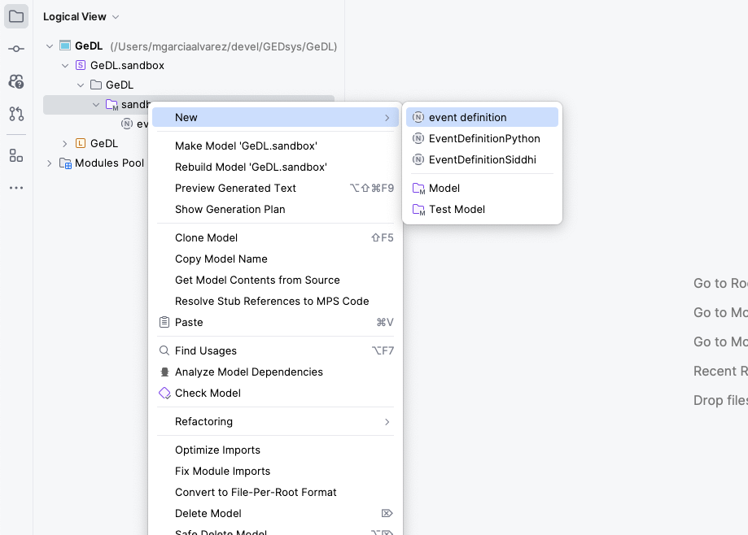

# GeDL

Geographic event Domain Language.

## Installation

**Requirements**

- [MPS 2023.3](https://www.jetbrains.com/mps/download/)

1. Clone or download the repository.
2. Using MPS, open the `GeDL` directory.
3. Make and build the language.

## Using GeDL

1. On MPS, right-clic on the `sandbox` directory inside the `GeDL.sanbox` directory. Then,  **New** and click **event definiton**.

    

2. Use the new create file for defining a geographic event. Below is an example of a valid defintion. Notice is not possible to pased the code into the MPS editor, the content most be typed in.  To get started press ENTER on the first line.

    ```java
    datastream Temperature : measurement ; 
    
    event hotDay ( Temperature ){ 
        cond Temperature > 19.f <logical operator> <comparison expression>; 
        extent city = {  
        feature: 'POLYGON((3.8 48, 8.9 48.5, 9 54, 9 49.5, 3.8 48))' ,  
        srid: 4326,
        buffer: 0.5f deg 
        } ; 
        <spatial granularity> 
        <detection time> 
    }; 
    
    notification hotDayAlert( hotDay) { 
        [ Temperature ] 
    }                                                                                                                                                                                                              
    ```
3. Rebuild the solution. The `GeDL.sandbox` contains solutions for the language. Right-click on `GeDL.sandbox`, and then click on `Rebuild Solutions`.

4. Generate text. Right-click on the `event definition` item you created and click on `Preview Generated Text`. This will generate two files containing SiddhiQL and Python code that can be used by the [GeDL interpreter](../gedl-interpreter/README.md) and the [Siddhi runner](../siddhi-runner/README.md) respectively.

Examples:

```java
// hotDAy.siddhi

@App:name('hotDay')
@App:description('A descriptionn of the app')

@source(
  type = 'http',
  receiver.url="http://localhost:8006/hotday-temperature",
  @map(type = 'json')
)
define stream Temperature (
  observedProperty string,
  resultTime string,
  result double,
  location object
);

@sink(
  type = 'log',
  @map(type = 'json', validate.json = 'true', enclosing.element = '$.gevent')
)
define stream hotDayAlert (
  notification string,
  observations object,
  detectionTime string
);

@info(name = 'hotDay')
from Temperature[result > 19.f]
select 'hotDayAlert' as notification,
map:create('Temperature',
    map:create(
      'observedProperty', Temperature.observedProperty,
      'resultTime', Temperature.resultTime,
      'result', Temperature.result,
      'location', Temperature.location
      ) ) as observations,
      time:currentTimestamp() as detectionTime
insert into hotDayAlert;
```

```python
# hotDay.py

"""
 Stream generator for hotDayevent.
"""

import os
from datetime import datetime
from dotenv import load_dotenv
from generator import StreamGenerator, Gevent, SensingService, EventProcessor

def main():
  # loads services settings
  sensingapi = SensigService(root_url=os.getenv("OBSERVATION_API"))
  cep = EventProcessor(events_url=os.getenv("EPE_RECEIVER_API"))

  expiration = datetime.now().replace(hour=datetime.now().hour+1)
  update_frequency = 5 # seconds
  detection_extent = 'POLYGON((3.8 48, 8.9 48.5, 9 54, 9 49.5, 3.8 48))'
  srid = 4326
  event_name = 'hotday'
  phenomena = ['Temperature']
  buffer = (0.5, 'deg')

  gevent = Gevent(name=event_name,
    expiration=expiration,
    phenomena=phenomena,
    update_frequency=update_frequency,
    detection_extent=detection_extent,
    buffer_distance=buffer[0]
    )

  stream_generator = StreamGenerator(gevent, sensingapi, cep)
  stream_generator.run()

if __name__ == "__main__":
  main()
```

