**GeDL:**

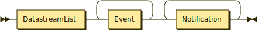

```
GeDL     ::= DatastreamList Event+ Notification+
```

**DatastreamList:**


```
DatastreamList
         ::= Datastream ( ',' Datastream )*
```

referenced by:

* GeDL

**Datastream:**

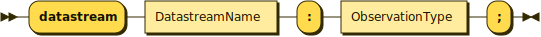

```
Datastream
         ::= 'datastream' DatastreamName ':' ObservationType ';'
```

referenced by:

* DatastreamList

**EventParameter:**

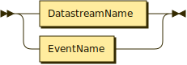

```
EventParameter
         ::= DatastreamName
           | EventName
```

referenced by:

* Event
* Function

**Event:**


```
Event    ::= 'event' EventName '(' EventParameter ( ',' EventParameter )* ')' '{' DetectionRules '}' ';'
```

referenced by:

* GeDL

**EventName:**


```
EventName
         ::= Identifier
```

referenced by:

* Event
* EventParameter
* Expression
* Notification
* NotificationPayload

**DatastreamName:**

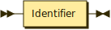

```
DatastreamName
         ::= Identifier
```

referenced by:

* Datastream
* EventParameter
* Expression
* NotificationPayload

**DetectionRules:**


```
DetectionRules
         ::= Condition DetectionExtent? SpatialGranularity? DetectionTime?
```

referenced by:

* Event

**Function:**

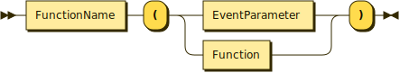

```
Function ::= FunctionName '(' ( EventParameter | Function ) ')'
```

referenced by:

* Expression
* Factor
* Function

**FunctionName:**

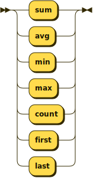

```
FunctionName
         ::= 'sum'
           | 'avg'
           | 'min'
           | 'max'
           | 'count'
           | 'first'
           | 'last'
```

referenced by:

* Function

**Condition:**

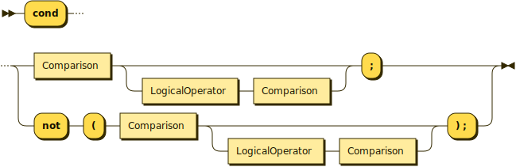

```
Condition
         ::= 'cond' ( Comparison ( LogicalOperator Comparison )? ';' | 'not' '(' Comparison ( LogicalOperator Comparison )? ') ;' )
```

referenced by:

* DetectionRules

**Comparison:**

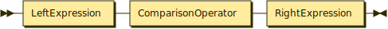

```
Comparison
         ::= LeftExpression ComparisonOperator RightExpression
```

referenced by:

* Condition

**Expression:**

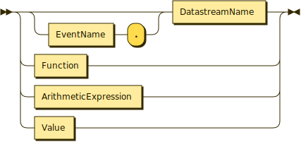

```
Expression
         ::= ( EventName '.' )? DatastreamName
           | Function
           | ArithmeticExpression
           | Value
```

**ArithmeticExpression:**


```
ArithmeticExpression
         ::= Term ( ( '+' | '-' ) Term )*
```

referenced by:

* Expression
* Factor

**Term:**

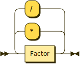

```
Term     ::= Factor ( ( '*' | '/' ) Factor )*
```

referenced by:

* ArithmeticExpression

**Factor:**

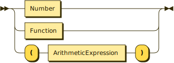

```
Factor   ::= Number
           | Function
           | '(' ArithmeticExpression ')'
```

referenced by:

* Term

**DetectionExtent:**

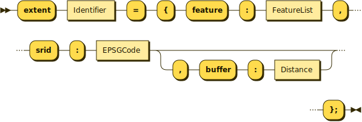

```
DetectionExtent
         ::= 'extent' Identifier '=' '{' 'feature' ':' FeatureList ',' 'srid' ':' EPSGCode ( ',' 'buffer' ':' Distance )? '};'
```

referenced by:

* DetectionRules

**SpatialGranularity:**

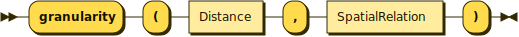

```
SpatialGranularity
         ::= 'granularity' '(' Distance ',' SpatialRelation ') ;'
```

referenced by:

* DetectionRules

**DetectionTime:**

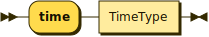

```
DetectionTime
         ::= 'time' TimeType ';'
```

referenced by:

* DetectionRules

**FeatureList:**

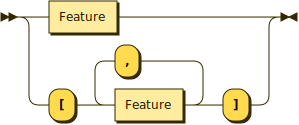

```
FeatureList
         ::= Feature
           | '[' Feature ( ',' Feature )* ']'
```

referenced by:

* DetectionExtent

**Notification:**

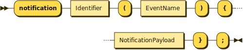

```
Notification
         ::= 'notification' Identifier '(' EventName ')' '{' NotificationPayload '}' ';'
```

referenced by:

* GeDL

**NotificationPayload:**


```
NotificationPayload
         ::= '[' ( EventName '.' )? DatastreamName ( ',' ( EventName '.' )? DatastreamName )* ']'
```

referenced by:

* Notification

**TimeType:**

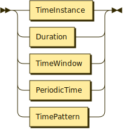

```
TimeType ::= TimeInstance
           | Duration
           | TimeWindow
           | PeriodicTime
           | TimePattern
```

referenced by:

* DetectionTime

**TimeInstance:**

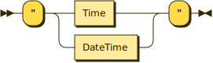

```
TimeInstance
         ::= '"' ( Time | DateTime ) '"'
```

referenced by:

* PeriodicTime
* TimePattern
* TimeType
* TimeWindow

**Duration:**

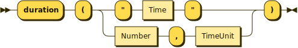

```
Duration ::= 'duration' '(' ( '"' Time '"' | Number ',' TimeUnit ) ')'
```

referenced by:

* TimeType
* TimeWindow

**TimeUnit:**

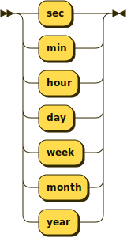

```
TimeUnit ::= 'sec'
           | 'min'
           | 'hour'
           | 'day'
           | 'week'
           | 'month'
           | 'year'
```

referenced by:

* Duration

**TimeWindow:**

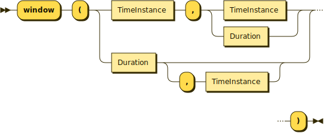

```
TimeWindow
         ::= 'window' '(' ( TimeInstance ',' ( TimeInstance | Duration ) | Duration ( ',' TimeInstance )? ) ')'
```

referenced by:

* PeriodicTime
* TimePattern
* TimeType

**PeriodicTime:**

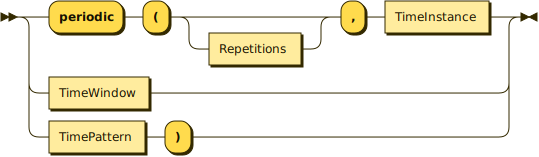

```
PeriodicTime
         ::= 'periodic' '(' Repetitions? ',' TimeInstance
           | TimeWindow
           | TimePattern ')'
```

referenced by:

* TimeType

**TimePattern:**

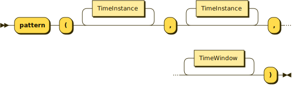

```
TimePattern
         ::= 'pattern' '(' TimeInstance* ',' TimeInstance* ',' TimeWindow* ')'
```

referenced by:

* PeriodicTime
* TimeType

**Repetitions:**


```
Repetitions
         ::= Number
```

referenced by:

* PeriodicTime

**DateTime:**

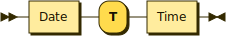

```
DateTime ::= Date 'T' Time
```

referenced by:

* TimeInstance

**Date:**

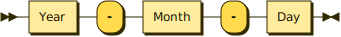

```
Date     ::= Year '-' Month '-' Day
```

referenced by:

* DateTime

**Time:**

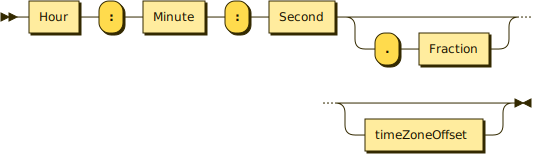

```
Time     ::= Hour ':' Minute ':' Second ( '.' Fraction )? timeZoneOffset?
```

referenced by:

* DateTime
* Duration
* TimeInstance

**Hour:**


```
Hour     ::= Digit Digit
```

referenced by:

* Time

**Year:**

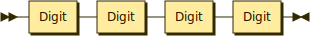

```
Year     ::= Digit Digit Digit Digit
```

referenced by:

* Date

**Month:**

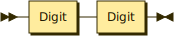

```
Month    ::= Digit Digit
```

referenced by:

* Date

**Day:**


```
Day      ::= Digit Digit
```

referenced by:

* Date

**Feature:**

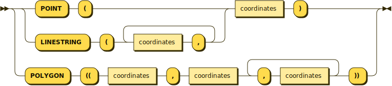

```
Feature  ::= ( 'POINT' '(' | 'LINESTRING' '(' ( coordinates ',' )+ ) coordinates ')'
           | 'POLYGON' '((' coordinates ',' coordinates ( ',' coordinates )+ '))'
```

referenced by:

* FeatureList

**coordinates:**

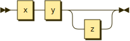

```
coordinates
         ::= x y z?
```

referenced by:

* Feature

**x:**


```
x        ::= Number
```

referenced by:

* coordinates

**y:**

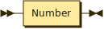

```
y        ::= Number
```

referenced by:

* coordinates

**z:**


```
z        ::= Number
```

referenced by:

* coordinates

**ComparisonOperator:**

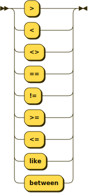

```
ComparisonOperator
         ::= '>'
           | '<'
           | '<>'
           | '=='
           | '!='
           | '>='
           | '<='
           | 'like'
           | 'between'
```

referenced by:

* Comparison

**LogicalOperator:**


```
LogicalOperator
         ::= '&&'
           | '||'
```

referenced by:

* Condition

**Identifier:**

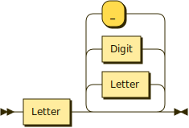

```
Identifier
         ::= Letter ( Letter | Digit | '_' )*
```

referenced by:

* DatastreamName
* DetectionExtent
* EventName
* Notification

**Value:**

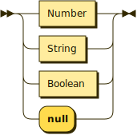

```
Value    ::= Number
           | String
           | Boolean
           | 'null'
```

referenced by:

* Expression

**Distance:**


```
Distance ::= Digit+ ( '.' Digit+ )? ( 'm' | 'mm' | 'cm' | 'Km' )
```

referenced by:

* DetectionExtent
* SpatialGranularity

**EPSGCode:**

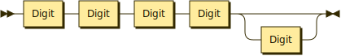

```
EPSGCode ::= Digit Digit Digit Digit Digit?
```

referenced by:

* DetectionExtent

**Number:**

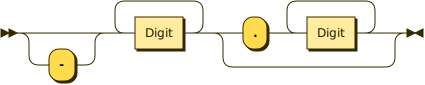

```
Number   ::= '-'? Digit+ ( '.' Digit+ )?
```

referenced by:

* Duration
* Factor
* Repetitions
* Value
* x
* y
* z

**Fraction:**

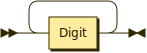

```
Fraction ::= Digit+
```

referenced by:

* Time

**String:**

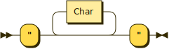

```
String   ::= '"' Char* '"'
```

referenced by:

* Value

**Char:**

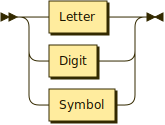

```
Char     ::= Letter
           | Digit
           | Symbol
```

referenced by:

* Comment
* String

**Whitespace:**

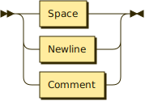

```
Whitespace
         ::= Space
           | Newline
           | Comment
```

**Comment:**

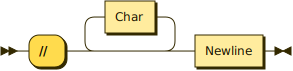

```
Comment  ::= '//' Char* Newline
```

referenced by:

* Whitespace

**Boolean:**


```
Boolean  ::= 'true'
           | 'false'
```

referenced by:

* Value

**Letter:**

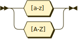

```
Letter   ::= [a-zA-Z]
```

referenced by:

* Char
* Identifier

**Digit:**

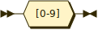

```
Digit    ::= [0-9]
```

referenced by:

* Char
* Day
* Distance
* EPSGCode
* Fraction
* Hour
* Identifier
* Month
* Number
* Year

**Symbol:**

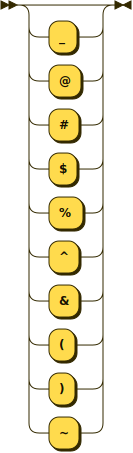

```
Symbol   ::= ( '_' | '@' | '#' | '$' | '%' | '^' | '&' | '(' | ')' | '~' )?
```

referenced by:

* Char

**SpatialRelation:**

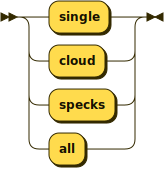

```
SpatialRelation
         ::= 'single'
           | 'cloud'
           | 'specks'
           | 'all'
```

referenced by:

* SpatialGranularity

**ObservationType:**


```
ObservationType
         ::= 'measurement'
           | 'count'
           | 'truth'
           | 'category'
```

referenced by:

* Datastream

**Newline:**

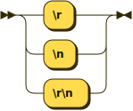

```
Newline  ::= '\r'
           | '\n'
           | '\r\n'
```

referenced by:

* Comment
* Whitespace

**Space:**


```
Space    ::= [#x9#xA#xD#x20]
```

referenced by:

* Whitespace

## 
 <sup>generated by [RR - Railroad Diagram Generator][RR]</sup>

[RR]: https://www.bottlecaps.de/rr/ui